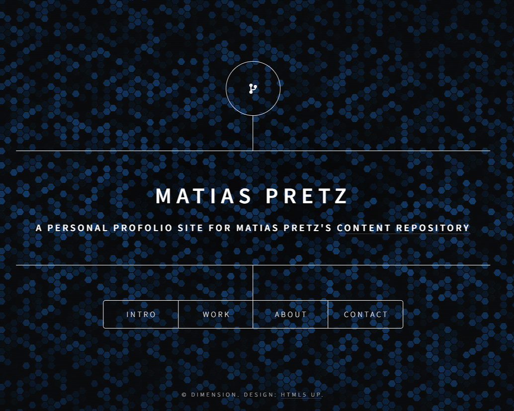

# Welcome to Matías Pretz's Personal Page Repository

## Introduction

Welcome to my personal page repository! This repository serves as a hub for my personal projects, portfolio, and a glimpse into my journey as a self-taught software developer. Here, you'll find a collection of projects that reflect my passion for coding and my desire to continuously learn and grow in the tech world.

## About Me

I'm Matías, a mid-30s self-learner with a keen interest in technology, programming, and all things software development. My journey began [mention how and when you started your journey into programming]. Since then, I've been on a relentless pursuit of knowledge, honing my skills, and experimenting with various technologies to bring my ideas to life.

## Projects

### Project 1 - [matipretz.github.io]

_Personal profolio page_

_Link: https://matipretz.github.io_

### Project 2 - [SecureKey]

_Description: A brief description of the project, its purpose, and what technologies were used._

_Link: [https://github.com/matipretz/SecureKey]_

## Contact Me

If you'd like to connect, discuss potential collaborations, or simply say hello, feel free to reach out to me through the following channels:

- Email: [matias.pretz@outlook.com]
- LinkedIn: [www.linkedin.com/in/matiaspretz]

## License

This project is licensed under the MIT. Feel free to use the code, provide feedback, or contribute to the project.

Thank you for visiting my personal page repository. I hope you find my work inspiring and engaging. Happy coding!

Matías.