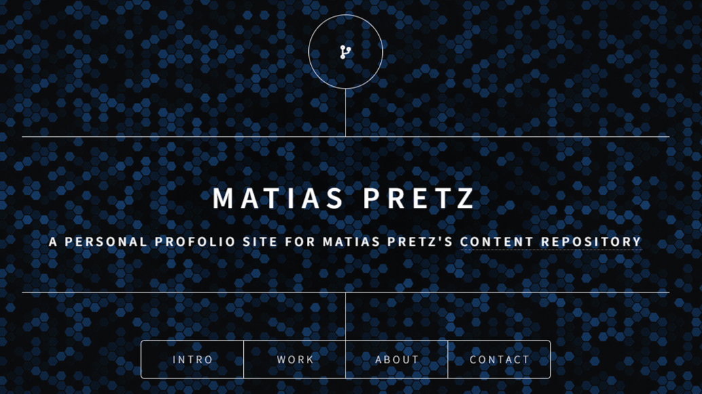
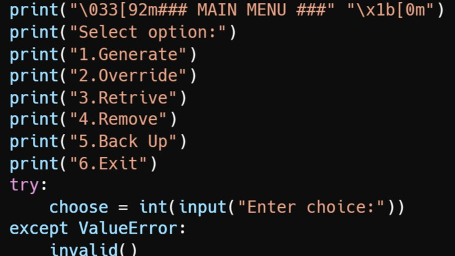

# Welcome to Matías Pretz's Personal Page Repository

## Introduction

Welcome to my personal page repository! This repository serves as a hub for my personal projects, portfolio, and a glimpse into my journey as a self-taught software developer. Here, you'll find a collection of projects that reflect my passion for coding and my desire to continuously learn and grow in the tech world.

## About Me

I'm Matías, a mid-30s self-learner passionate about technology and programming. My curiosity led me to disassemble computers and take repair courses. I then explored Java, OOP, and SQL, and recently refreshed my Java skills. Currently, I'm immersed in a full-stack bootcamp, mastering Python, Django, HTML, CSS, and JavaScript. I love hands-on learning and have an eye for detail. Always seeking growth, I'm excited to make a meaningful impact as a software developer.

## Projects

### Project 1 - [matipretz.github.io]

_Personal profolio page_

_[Link](https://matipretz.github.io)_

### Project 2 - [SecureKey]

_SecureKey is a password management application that allows you to store your passwords._

_[Link](github.com/matipretz/SecureKey)_

## Contact Me

If you'd like to connect, discuss potential collaborations, or simply say hello, feel free to reach out to me through the following channels:

- [Contact form: matipretz.github.io](https://matipretz.github.io/#contact)
- [LinkedIn](www.linkedin.com/in/matiaspretz)

## License

This project is licensed under the MIT. Feel free to use the code, provide feedback, or contribute to the project.

Thank you for visiting my personal page repository. I hope you find my work inspiring and engaging. Happy coding!

Matías.
